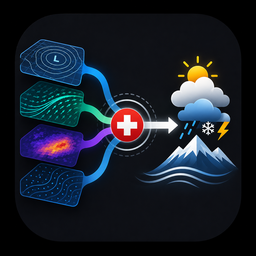

  

# SwissWeather Fusion

A Home Assistant integration that fuses multiple weather forecast sources —
MeteoSwiss's ICON-CH1-EPS and ICON-CH2-EPS, DWD's ICON-D2, SRF (SRG SSR),
and meteoblue — into a single locally-corrected forecast, continuously
learning the bias between each source and your own weather station. It
also runs a short-horizon storm-onset indicator for summer convective
weather (temperature/rain arriving together with a pressure signature),
using MeteoSwiss's CombiPrecip radar feed and an optional independent
check from Meteonomiqs.

**Status: v0.2.0.** The core architecture is built and the business
logic (bias correction, storm scoring, radar sampling) is extensively
unit-tested — 507 tests, pyflakes clean. v0.1.24–v0.1.28 is a large remediation
release closing 62 defects found across two external audits and one
independent audit: see
[swissweather_fusion_v0.2.0_release_audit.md](swissweather_fusion_v0.2.0_release_audit.md)
for the full account, including the five places the external audits were
themselves wrong.

Continued real-world testing remains the priority. This is a
carefully-reviewed codebase, not a battle-tested one.

> **Upgrading from any earlier version?** This release rebuilds the learning
> database (schema v3). Learned bias statistics, radar observations and
> storm predictions are discarded and relearned, because three fixes
> changed what those stored values *mean*. Raw forecasts and station
> observations are preserved. You will also be asked, once, whether your
> pressure sensor reports sea-level or station-level pressure — see
> below.

## Which pressure sensor to choose

This matters more than it looks. Netatmo — and several other stations —
publish **two** pressure values:

| Entity | What it is |
| --- | --- |
| `sensor.<station>_pressure` | Normalised to **mean sea level** using the altitude captured during setup |
| `sensor.<station>_absolute_pressure` | The **raw** pressure measured at your station's altitude |

Home Assistant gives both the same `atmospheric_pressure` device class,
so the integration cannot tell them apart — you have to say which one you
picked. During setup there is a checkbox, **"My pressure sensor already
reports sea-level pressure"**:

- Using **absolute pressure**? Leave it **off** (the default). The
  integration reduces the reading to sea level itself.
- Using the normalised **pressure** entity? Turn it **on**.

Getting this wrong introduces a constant error of roughly 60 hPa at 500 m
altitude, which Model A would otherwise faithfully learn as forecast
"bias". You can change the answer later under **Configure**.

## What this does

- **Model A** — blends CH1, CH2, ICON-D2, SRF, and meteoblue's forecasts,
  each corrected for its own systematic bias against your specific
  location, learned continuously and automatically (no manual tuning).
- **Model B** — watches your station's pressure/humidity/temperature trend
  plus a live radar precipitation reading (at your location and three
  points upwind, roughly 20/35/60 minutes out) for the classic summer
  storm signature, and exposes a live "storm probability" percentage —
  useful for automations like closing blinds ahead of a downpour.

This is **not** a replacement for professional weather models — it can't
run atmospheric physics. It corrects and blends forecasts that already
exist, the same way national weather services localize their own
forecasts (a technique called Model Output Statistics).

## Requirements

- A Home Assistant instance with local temperature, humidity, and pressure
  sensors already set up (rain/wind support is planned for later).
- Four free API credentials (no cost for the tiers this integration uses):
  - **SRF (SRG SSR)**: register at [developer.srgssr.ch](https://developer.srgssr.ch),
    create an App on the "SRG SSR PUBLIC API V2" product, get a consumer
    key/secret.
  - **meteoblue**: register for the free Weather API at
    [meteoblue.com](https://www.meteoblue.com).
  - **Meteonomiqs (wetter.com)**: contact `info@meteonomiqs.com` for an API
    key.
  - MeteoSwiss's own CH1/CH2 data and DWD's ICON-D2 are fetched via
    [Open-Meteo](https://open-meteo.com), which needs no account or key.
    An Open-Meteo API key is optional — only relevant if you're on their
    paid/commercial tier (higher rate limits and dedicated
    infrastructure; it does not make CH1/CH2/D2 refresh more often, since
    that's fixed by MeteoSwiss/DWD's own model schedule). Leave it blank
    for the free tier.

## Installation

1. Add this repository as a custom repository in HACS, or copy
   `custom_components/swissweather_fusion` into your `config/custom_components/` folder.
2. Restart Home Assistant.
3. Go to **Settings → Devices & Services → Add Integration**, search for
   "SwissWeather Fusion".
4. Follow the setup steps: location & elevation, local station sensors,
   then the four API credentials.

### About the icon

`icons/icon.png` (256×256) and `icons/icon@2x.png` (512×512) are included,
sized to match the [home-assistant/brands](https://github.com/home-assistant/brands)
convention. Worth being upfront about a real limitation here: for a
private/custom HACS repository (added manually, not the default HACS
store), there isn't a way to make this icon show natively next to the
integration in HA's own Settings → Devices & Services list or HACS's
store UI — that specific placement is sourced from the `brands` repository,
which requires submitting a PR there and is really only appropriate once
this is a public, stable, more broadly-used integration. Until then, the
icon displays wherever this repo's README is rendered (HACS's own repo
info page, GitHub itself), which is what's set up above.

## Configuration notes

- **Location**: use precise coordinates, not a postal code — this
  integration exists to correct for microclimate variation, and a postal
  code covers an area wider than that variation.
- **Elevation**: auto-looked-up from your coordinates by default; enter a
  manual value if you have a more precise one (e.g. from a differential
  GPS survey) — this feeds an optional physics-based correction that gives
  Model A a head start before it's learned anything from data yet.
- Everything is editable later via the integration's **Configure** button,
  not just at initial setup.

## Sensors

Beyond the main `weather.*` entity, this integration exposes:

- `sensor.*_status`, `*_forecast_accuracy`, `*_active_sources`
- `sensor.*_last_learning_a` / `*_last_learning_b` — when each model last
  updated its correction
- `sensor.*_expert_weight_<source>` — one per blend source, for seeing how
  much each is currently trusted
- `sensor.*_storm_onset_probability` — the live storm indicator
- Per-source health: `*_last_success`, `*_last_poll_duration`,
  `*_last_data_error`, `*_consecutive_failures`, and `*_last_auth_error`
  for SRF specifically
- `binary_sensor.*_degraded` — one glance-able "is anything unhealthy" flag

## Known v0.1 limitations

- `forecast_accuracy` and `last_learning_b` are honest stubs (return
  `None`) — `forecast_accuracy` pending a real rolling-MAE implementation,
  `last_learning_b` because Model B's v1 trained classifier genuinely
  doesn't exist yet (see DEVELOPER.md for the v0→v1 upgrade path).
  `last_learning_a` is no longer a stub — Model A's actual bias-learning
  step (comparing past forecasts against real station readings and
  updating the learned correction) now runs every 20 minutes; this sensor
  reports its last real run.
- The CombiPrecip radar client's HDF5 parsing is built against the
  documented ODIM_H5 standard, not a downloaded real file (no network
  access to data.geo.admin.ch in the environment that built this) — worth
  verifying against a real file early.
- Model B's v0 rule is a hand-crafted heuristic, not a trained model — see
  DEVELOPER.md for the upgrade path once a storm season of data exists.

## Diagnostics

Per-source health is real, not a placeholder: each of the 5 vendor
integrations (Open-Meteo, tracked per-model since CH1/CH2/D2 can fail
independently; SRF; meteoblue; CombiPrecip; Meteonomiqs) exposes its own
last-success time, last poll duration, consecutive-failure count, and —
critically — **data errors and auth errors as separate sensors**. An
expired or revoked credential (SRF is the one source with a true
credential that can expire) shows up specifically as
`sensor.*_srf_last_auth_error`, distinct from a generic timeout, since the
fix is different (re-enter credentials vs. just wait for the normal
retry). `binary_sensor.*_degraded` gives one glance-able "is anything
wrong" flag; the per-source sensors tell you which one and why.

### Detailed diagnostic logging (off by default)

For deeper troubleshooting than the per-source sensors give you, this
integration has a toggleable, downloadable diagnostic log:

1. **Settings → Devices & Services → SwissWeather Fusion → Configure**,
   enable "Enable detailed diagnostic logging." This reloads the
   integration and starts capturing detailed events (poll attempts,
   successes, failures, and — for SRF specifically — the full raw API
   response body) into memory.
2. Let the problem you're investigating actually happen.
3. **Settings → Devices & Services → SwissWeather Fusion → ⋮ (three-dot
   menu) → Download Diagnostics.** This uses Home Assistant's own
   built-in diagnostics mechanism — no custom download tool, just the
   standard one every integration can use.
4. Turn the toggle back off once you're done, if you don't want it
   running continuously.

Two things worth knowing about this file before you share it:
- **Credentials, coordinates, and elevation are redacted automatically**,
  including inside raw third-party API response bodies (not just this
  integration's own configuration) — location data can be embedded in a
  third-party response in fields this project doesn't fully control the
  shape of, so redaction is deliberately broad rather than a fixed list
  of known keys.
- **The buffer is in-memory only** — it resets on restart or reload
  (including when you toggle the setting itself, since that reloads the
  integration). It's meant for "enable it, reproduce the problem, download
  it" in one sitting, not a historical log you can look back at days
  later.

## More detail

See [DEVELOPER.md](DEVELOPER.md) for the full architecture rationale —
why two models instead of one, why EMA instead of gradient boosting, why
each source was included or rejected, and what's actually been verified
versus what's a documented best guess.
